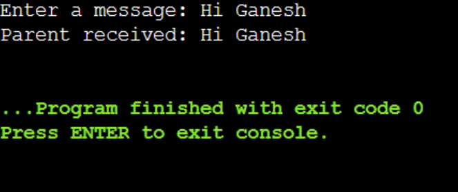

# OS-EX.6-IMPLEMENTATION-OF-INTER-PROCESS-COMMUNICATION-USING-PIPE

## AIM:
To Write C program to illustrate IPC using pipes mechanisms.

## ALGORITHM:
## Step 1:

Import the os module for process management and communication.
## Step 2:

Define a main() function as the program's entry point.
## Step 3:

Prompt the user to input a message and encode it as bytes.
## Step 4:

Create two pipes, parent_pipe and child_pipe, for communication.
## Step 5:

Fork a child process using os.fork().
## Step 6:

In the child process, close the parent's pipe end and write the message to the child's pipe end.4
## Step 7:
In the child process, close the child's pipe end.

## Step 8:

Exit the child process.
## Step 9:

In the parent process, close the child's pipe end.
## Step 10:
Read the message from the parent's pipe end, decode it, and print it.

## PROGRAM:
```python
Developed by: Ganesh R
Reg No: 212222240029
import os

def main():
    message = input("Enter a message: ").encode()
    parent_pipe, child_pipe = os.pipe()

    child_pid = os.fork()

    if child_pid == 0:
        os.close(parent_pipe)
        os.write(child_pipe, message)
        os.close(child_pipe)
        exit(0)
    else:
        os.close(child_pipe)
        received_message = os.read(parent_pipe, 100)
        os.close(parent_pipe)
        print("Parent received:", received_message.decode())

if __name__ == "__main__":
    main()
```


## OUTPUT:



## RESULT:
This output confirms that the parent process successfully received and printed the message sent by the child process through the pipe, demonstrating inter-process communication using pipes.
